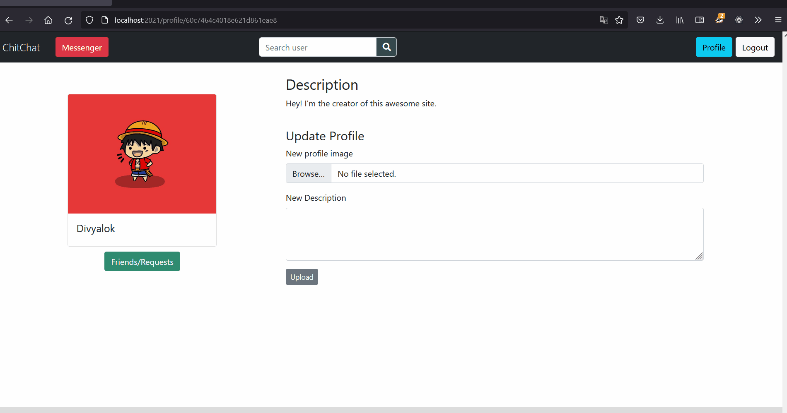
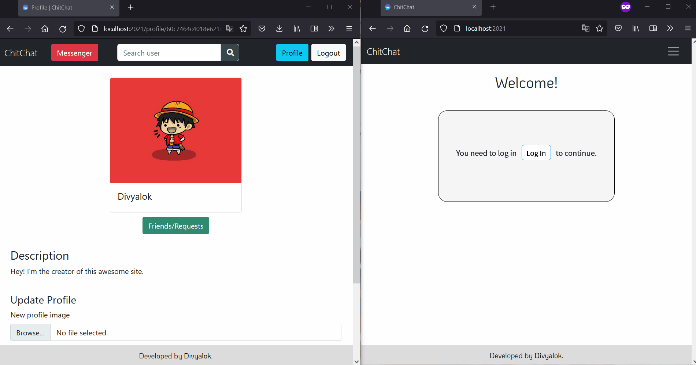

# ChitChat

Chitchat is a minimalistic real-time private chatting application where users can register and chat with their friends. 

To run this app locally:

* Install NodeJS
* Clone the repo: git clone "https://github.com/Divyalok123/ChitChat.git"
* Change directory: cd ChitChat
* Install dependencies: "npm install"
* Run the app: "npm start"
* The app will be visible at: "localhost:2021" 

## Prodecure: 

Open App -> Register -> Create a profile -> Search Users -> Send friend request -> Go to messenger and start chatting. That's it!

## Tech Used: 
I used VanillaJS, EJS templates, Boostrap and CSS for the UI and NodeJS, Mongoose, Express, Axios for the backend. 

You can see the demo of the app below or in the *demo* folder above.

### Intro
  

### Friend Request
  

### Messenger

